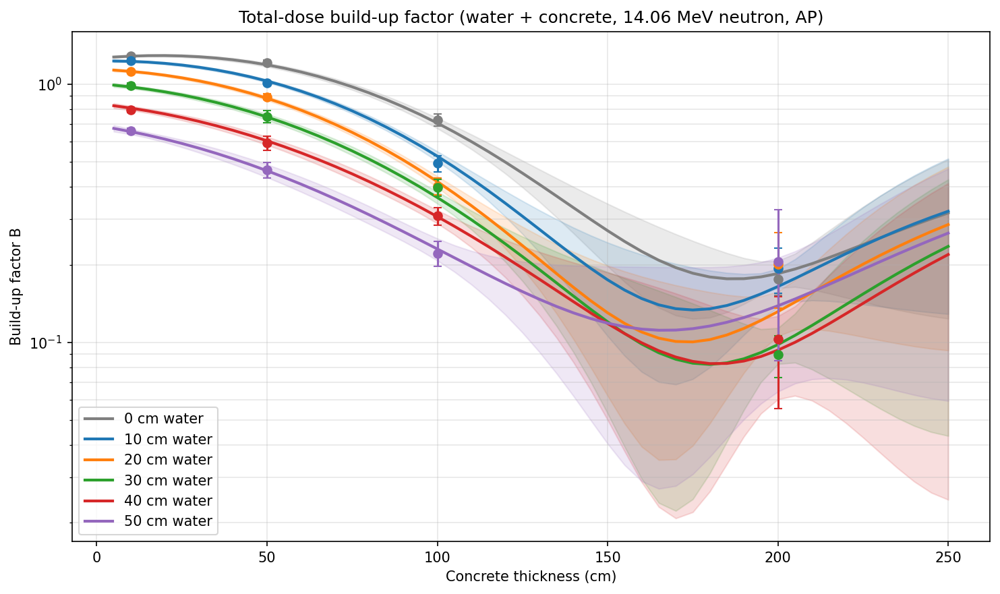
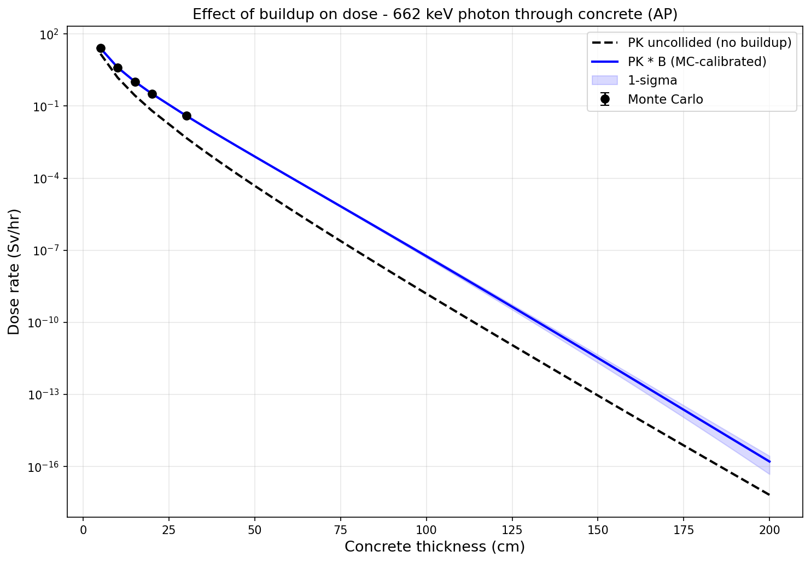

# Many thicknesses and extrapolation

Running Monte Carlo at every thickness is expensive. A more practical approach is to run Monte Carlo at a few thin shields, then interpolate and extrapolate the build-up factor to all thicknesses.

## Why Gaussian Processes?

Build-up factors don't follow a simple functional form - they depend on material, energy, geometry, and thickness in complex ways. Fitting a polynomial or exponential would impose assumptions about the shape that may not hold.

A Gaussian Process (GP) makes **no assumption about the functional form**. Instead it:

- **Learns the shape from the data** - whatever the Monte Carlo points show, the GP follows
- **Gives uncertainty estimates** - tight near data, wider far away, honestly reflecting what we don't know
- **Accounts for Monte Carlo noise** - each data point has a statistical uncertainty that the GP uses to avoid overfitting

This makes it robust across different materials and geometries without needing to choose a fitting function.

`BuildupTable` wraps the [inference-tools](https://github.com/C-bowman/inference-tools) GP with adaptive kernel length scales to prevent overfitting.

## Basic example

Run Monte Carlo at 4 thicknesses, then extrapolate to 10:

```python
import rad_point_kernel as rpk

concrete = rpk.Material(
    composition={
        "H": 0.01, "O": 0.53, "Si": 0.34,
        "Ca": 0.04, "Al": 0.03, "Fe": 0.01,
    },
    density=2.3,
    fraction="mass",
)

SOURCE = 1e12
source = rpk.Source("photon", 1e6)

# Step 1: Monte Carlo at 4 thicknesses
mc_thicknesses = [5, 10, 15, 20]
mc_geometries = [
    [rpk.Layer(thickness=t, material=concrete)]
    for t in mc_thicknesses
]

mc_results = rpk.compute_buildup(
    geometries=mc_geometries,
    source=source,
    quantities=["dose-AP"],
)

for t, r in zip(mc_thicknesses, mc_results):
    print(f"  {t:>2d} cm: B = {r.buildup['dose-AP']:.3f}")

# Step 2: Build interpolation table
table = rpk.BuildupTable(
    points=[{"thickness": t} for t in mc_thicknesses],
    results=mc_results,
)

# Step 3: Predict build-up at any thickness
all_thicknesses = mc_thicknesses + [30, 50, 75, 100, 150, 200]
for t in all_thicknesses:
    layers = [rpk.Layer(thickness=t, material=concrete)]
    bi = table.interpolate(thickness=t)

    result = rpk.calculate_dose(SOURCE, layers, source, "AP", buildup=bi)

    status = "EXTRAPOLATED" if bi.is_extrapolated else "interpolated"
    print(f"  {t:>3d} cm: dose = {result.dose_rate:.4e} Sv/hr, "
          f"B = {bi.value:.3f} +/- {bi.sigma:.3f} ({status})")
```

## InterpolationResult

`table.interpolate()` returns an `InterpolationResult` with:

- `value` - predicted build-up factor
- `sigma` - GP uncertainty (1 standard deviation)
- `is_extrapolated` - True if the query point is outside the range of Monte Carlo data
- `extrapolated_axes` - dict showing which axes are extrapolated and by how much

Uncertainty grows with distance from data points:

```python
r_near = table.interpolate(thickness=15)
r_far = table.interpolate(thickness=200)
# r_far.sigma will be much larger than r_near.sigma
```

## Using InterpolationResult as build-up

You can pass an `InterpolationResult` directly to any calculation function:

```python
bi = table.interpolate(thickness=50)
result = rpk.calculate_dose(
    1e12,
    [rpk.Layer(thickness=50, material=concrete)],
    source, "AP",
    buildup=bi,
)
```

## Using your own build-up values

You don't have to use `BuildupTable` - if you have build-up factors from another source (literature, your own fitting, a different interpolation method), you can apply them directly:

```python
# Your own B value from any source
my_B = 3.2
result = rpk.calculate_dose(
    1e12, layers, source, "AP",
    buildup=rpk.BuildupModel.constant(my_B),
)
```

This means you can use any interpolation or fitting method you prefer - scipy, scikit-learn, a lookup table, or even a hand-drawn curve - and feed the result into the point-kernel calculation.

## Multi-dimensional extrapolation

`BuildupTable` supports N-dimensional parameter spaces. For example, with water and concrete thicknesses as two axes:

```python
import rad_point_kernel as rpk

water = rpk.Material(composition={"H2O": 1.0}, density=1.0)
concrete = rpk.Material(
    composition={
        "H": 0.01, "O": 0.53, "Si": 0.34,
        "Ca": 0.04, "Al": 0.03, "Fe": 0.01,
    },
    density=2.3,
    fraction="mass",
)

# Monte Carlo at a grid of (water, concrete) thicknesses
mc_water = [0, 10, 20]
mc_conc = [10, 20, 30]
points = []
geometries = []
for w in mc_water:
    for c in mc_conc:
        points.append({"water": w, "conc": c})
        layers = [rpk.Layer(thickness=1000)]
        if w > 0:
            layers.append(rpk.Layer(thickness=w, material=water))
        layers.append(rpk.Layer(thickness=c, material=concrete))
        geometries.append(layers)

source = rpk.Source("neutron", 14.06e6)
mc_results = rpk.compute_buildup(
    geometries=geometries,
    source=source,
    quantities=["dose-AP"],
)

table = rpk.BuildupTable(points=points, results=mc_results)

# Query at any (water, concrete) combination
bi = table.interpolate(water=15, conc=25)
print(f"B = {bi.value:.3f} +/- {bi.sigma:.3f}")
```

## Plotting build-up factors with uncertainty

```python
import matplotlib.pyplot as plt
import numpy as np

# After running Monte Carlo and building a table (as above)
thicknesses = np.linspace(5, 200, 100)
b_values = []
b_lo = []
b_hi = []

for t in thicknesses:
    bi = table.interpolate(thickness=float(t))
    b_values.append(bi.value)
    b_lo.append(bi.value - bi.sigma)
    b_hi.append(bi.value + bi.sigma)

fig, ax = plt.subplots()
ax.plot(thicknesses, b_values, "b-", label="GP prediction")
ax.fill_between(thicknesses, b_lo, b_hi, color="blue", alpha=0.15, label="1-sigma")

# Monte Carlo points
mc_bs = [r.buildup["dose-AP"] for r in mc_results]
ax.plot(mc_thicknesses, mc_bs, "ko", markersize=7, label="Monte Carlo")

ax.set_xlabel("Thickness (cm)")
ax.set_ylabel("Build-up factor B")
ax.legend()
```



## Plotting dose with uncertainty

```python
import matplotlib.pyplot as plt

doses = []
doses_lo = []
doses_hi = []

for t in all_thicknesses:
    layers = [rpk.Layer(thickness=t, material=concrete)]
    bi = table.interpolate(thickness=t)
    pk = rpk.calculate_dose(SOURCE, layers, source, "AP")
    doses.append(pk.dose_rate * bi.value)
    doses_lo.append(pk.dose_rate * (bi.value - bi.sigma))
    doses_hi.append(pk.dose_rate * (bi.value + bi.sigma))

fig, ax = plt.subplots()
ax.plot(all_thicknesses, doses, "b-", label="PK with build-up")
ax.fill_between(all_thicknesses, doses_lo, doses_hi, color="blue", alpha=0.15)

# Monte Carlo reference points
mc_doses = [r.mc["dose-AP"] * SOURCE for r in mc_results]
ax.plot(mc_thicknesses, mc_doses, "ko", markersize=7, label="Monte Carlo")

ax.set_xlabel("Thickness (cm)")
ax.set_ylabel("Dose rate (Sv/hr)")
ax.set_yscale("log")
ax.legend()
```


