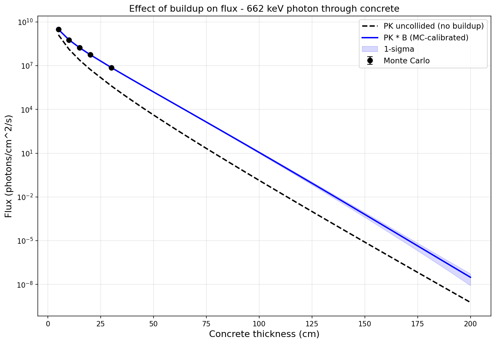

# Build-up Factors

## Why they're needed

The point-kernel method computes uncollided flux: particles that travel straight from source to detector without any interaction. In reality, scattered particles also reach the detector, adding to the dose. The build-up factor $B$ corrects for this:

$$\Phi_{\text{total}} = \Phi_{\text{uncollided}} \cdot B$$

For shielding design, ignoring build-up is **non-conservative**; it underestimates the dose.

## Properties of B

- $B \geq 1$ always (scattered particles add dose, never subtract)
- $B$ increases with shield thickness (thicker shields scatter more)
- $B$ depends on material (hydrogenous materials have larger $B$)
- $B$ depends on energy and particle type
- $B$ depends on layer ordering in multi-layer shields

## Why not use tabulated data?

Traditional approaches (ANSI/ANS-6.4.3, Hila et al.) provide pre-computed build-up factors, but they have fundamental limitations:

- **Energy binning**: Tabulated values are computed at discrete energies and interpolated. Cross sections have resonance structure that this misses, especially for neutrons where removal cross sections are isotope-specific.
- **Material mixing**: Tables exist per element (photons) or per isotope (neutrons), but real shields are compounds. Combining elemental $B$ values needs a mixing rule (Harima, Bremer-Roussin, Broder), all of which are approximate because buildup depends on the *correlated* scatter history through the material. A photon that Compton-scatters on hydrogen and then photoelectric-absorbs on iron is not represented in either pure-H or pure-Fe tables. The error is small when constituent Z values are similar or one element dominates the cross section, and largest when the compound mixes low-Z (Compton) and high-Z (photoelectric) elements in comparable amounts (e.g. heavy concrete with steel rebar, or tungsten-loaded polymers), or when the photon energy sits near a K-edge.
- **Geometry specificity**: Tabulated $B$ values are for infinite homogeneous media. Real multi-layer shields have $B$ that depends on layer ordering; two different layer combinations with the same total optical thickness can have different $B$ values.

## Our approach: Monte Carlo computed B

Instead, this tool computes $B$ directly from Monte Carlo simulation for the user's exact geometry:

$$B = \frac{\text{MC dose (total, all scattering)}}{\text{PK dose (uncollided only)}}$$

OpenMC runs full particle transport with pointwise cross sections (no energy binning), tracking every scatter and energy loss. The ratio MC/PK gives the exact build-up factor for that specific geometry, material combination, and source energy.

**Advantages:**

- **Pointwise energy treatment**: OpenMC uses continuous-energy cross sections, capturing all resonance structure
- **Exact geometry**: $B$ is computed for the user's specific layer stack, not a generic infinite medium
- **Statistical uncertainty**: Each Monte Carlo result comes with a standard deviation, which propagates through to the final dose estimate
- **Works for any material**: No need for pre-computed tables per element; any user-defined composition works

## Analytical-form fit and extrapolation

Running Monte Carlo for every thickness is expensive. The workflow is:

1. **Run Monte Carlo on a few thin shields** (e.g. 4-6 thicknesses) - these are cheap to simulate
2. **Fit a closed-form expression** to the $B$ values vs thickness, weighted by the Monte Carlo statistical uncertainty
3. **Predict $B$ at any thickness** by evaluating the fitted form

`BuildupFit` uses two forms depending on the input dimensionality:

- **1D (single material)**: Shin-Ishii / Taylor double-exponential
  $B(\mu t) = A \cdot e^{-\alpha_1 \mu t} + (1 - A) \cdot e^{-\alpha_2 \mu t}$.
  Three free parameters with $B(0) = 1$ baked in. Validated empirically
  to capture growth, decay, peak-and-decay (light multipliers like
  beryllium), and dip-and-recover all with one functional form. The
  literature precedent is Shin & Ishii (1990s) for neutrons in concrete
  and iron; the same form was Taylor's original photon expression.
- **Multi-D (multi-layer geometries)**: thin-plate-spline RBF with
  degree-1 polynomial augmentation. No hyperparameters; works on
  scattered points.

Each Monte Carlo data point has a statistical uncertainty $\sigma_B$ that the fit uses for weighted least squares: tight points pull the fit harder than noisy ones.

*Build-up factor vs concrete thickness for different water thicknesses. Dots are Monte Carlo simulations with error bars. Lines are the fitted forms.*

## Flux vs dose build-up

Build-up factors for flux and dose are different:

- **$B_{\text{flux}}$**: Corrects particle count (all scattered particles regardless of energy)
- **$B_{\text{dose}}$**: Corrects dose (scattered particles weighted by their energy-dependent dose coefficient)

Since scattered particles have lower energies and dose coefficients change with energy, $B_{\text{flux}} \neq B_{\text{dose}}$ in general. For shielding design, use dose build-up.

## Effect of build-up on flux estimates

Without build-up correction, the point-kernel method underestimates the flux, especially for thick shields where scattered particles dominate:

*Flux vs shield thickness for a 662 keV photon source through concrete. The PK uncollided estimate (dashed) increasingly underestimates the true flux as thickness grows; $B_{\text{flux}}$ counts every scattered particle regardless of energy.*

## Effect of build-up on dose estimates

The same effect applies to **dose**, though smaller than for flux because $B_{\text{dose}}$ weights scattered particles by their (lower) dose coefficient while $B_{\text{flux}}$ counts them all:

*Dose rate vs shield thickness for the same source and shield. The dashed line (PK uncollided) underestimates compared to the solid line (PK with Monte Carlo build-up correction). Monte Carlo simulation points confirm the corrected estimate. $B_{\text{dose}}$ is typically 0.5-0.7x smaller than $B_{\text{flux}}$ at the same thickness.*
